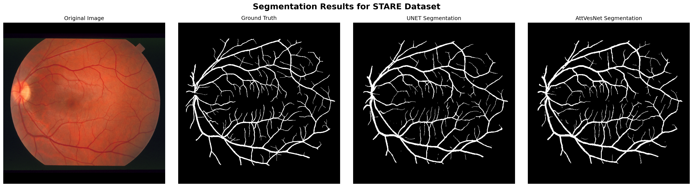

# Spatial-AttVesNet: A Low-Parameter Vascular Segmentation Using Attention Mechanisms

This repository presents a comprehensive comparative study evaluating the performance of the **Spatial-AttVesNet** model against a **Simple U-Net** for retinal blood vessel segmentation. This research highlights the superior performance of Spatial-AttVesNet for this critical task, notable for its efficiency achieved through a low parameter count and advanced attention mechanisms.

## Project Context

Accurate segmentation of retinal vessels is paramount for the early diagnosis and effective monitoring of various ocular pathologies, including diabetic retinopathy. This study addresses the following key objectives:

1.  **Quantitative and Qualitative Comparison:** To perform a rigorous evaluation of the segmentation performance of Spatial-AttVesNet versus a standard U-Net.
2.  **Robust Validation:** To validate model efficacy across established public datasets and a unique local dataset, MDRID, collected at the Mohammed VI University Hospital (CHU) in Oujda.
3.  **Visual Assessment:** To provide clear and compelling visualizations of the segmentation capabilities of both models, including their performance on images representing different stages of diabetic retinopathy.

## Datasets

The models underwent training and evaluation on the following diverse datasets:

### Public Benchmarks:
* [**STARE**](https://cecas.clemson.edu/~ahoover/stare/) (STructured Analysis of the REtina)
* [**HRF**](https://www5.cs.fau.de/research/data/fundus-images/) (High-Resolution Fundus)
* [**CHASE_DB1**](https://blogs.kingston.ac.uk/retinal/chasedb1/)

### Proprietary Dataset:
* **MDRID** (Moroccan Diabetic Retinopathy Image Dataset): A locally collected dataset from the Mohammed VI University Hospital in Oujda. All images within this dataset were comprehensively segmented by both models for in-depth comparative analysis.

## Models Compared

1.  **Spatial-AttVesNet** (`Spatial-AttVesNet.ipynb`): An advanced deep learning architecture designed to enhance focus on crucial vessel features through integrated spatial attention mechanisms. This model aims for superior performance with optimized computational efficiency.
2.  **Simple U-Net** (`UNET-SIMPLE.ipynb`): A standard implementation of the U-Net architecture, serving as a well-established baseline for evaluating the performance advancements introduced by Spatial-AttVesNet.

## Methodology

The comparative study adhered to a systematic methodology:

1.  **Data Preprocessing:** Preparation and standardization of images from all utilized datasets.
2.  **Model Training:** Each model (Spatial-AttVesNet and Simple U-Net) was trained on the datasets. Comprehensive training details, including hyperparameters, loss functions, and metrics, are provided within the respective notebooks.
3.  **Quantitative Evaluation:** Calculation of standard performance metrics for segmentation on the test sets, including:
    * Dice Coefficient
    * Jaccard Index
    * Sensitivity
    * Specificity
    * AUC-ROC
4.  **Qualitative Evaluation:**
    * Visualization of segmentation masks generated by each model on images from both public and MDRID datasets.
    * Generation of comparative figures showcasing side-by-side results from both models.
    * Creation of specific figures illustrating the segmentation of 4 images for each class of diabetic retinopathy (based on the MDRID dataset classification), segmented by both models.

## Key Findings

The study demonstrates that **Spatial-AttVesNet significantly outperforms the Simple U-Net model** in retinal vessel segmentation performance across all tested datasets. Improvements are evident in both quantitative metrics and the visual quality of the segmentations, while maintaining a low parameter count.

*(Example: Spatial-AttVesNet achieved an average Dice coefficient of X% compared to Y% for the Simple U-Net on the MDRID dataset.)*

## Repository Structure

* `Spatial-AttVesNet.ipynb`: Jupyter notebook containing the implementation, training, evaluation, and visualization generation for the Spatial-AttVesNet model.
* `UNET-SIMPLE.ipynb`: Jupyter notebook containing the implementation, training, evaluation, and visualization generation for the Simple U-Net model.
* `README.md`: This file.
* `/images/`: Directory containing generated comparative figures.
    * `CHASEDB1_segmentation_comparison.png`
    * `HRF_segmentation_comparison.png`
    * `STARE_segmentation_comparison.png`
    * (Further subdirectories for MDRID comparisons or diabetic retinopathy stages can be added here if applicable.)

## How to Use

1.  **Clone the Repository:**
    ```bash
    git clone [https://github.com/SanaeLamti/Spatial-AttVesNet-A-Low-Parameter-Vascular-Segmentation-Using-Attention-Mechanisms.git](https://github.com/SanaeLamti/Spatial-AttVesNet-A-Low-Parameter-Vascular-Segmentation-Using-Attention-Mechanisms.git)
    cd Spatial-AttVesNet-A-Low-Parameter-Vascular-Segmentation-Using-Attention-Mechanisms
    ```
2.  **Prerequisites:**
    * Python 3.x
    * Jupyter Notebook or Jupyter Lab
    * Required Libraries (recommended to create a virtual environment):
        ```bash
        python -m venv venv
        # On Windows: .\venv\Scripts\activate
        # On macOS/Linux: source venv/bin/activate
        pip install tensorflow opencv-python scikit-learn matplotlib numpy pillow jupyterlab
        ```
3.  **Data Acquisition:**
    * Download public datasets (STARE, HRF, CHASE_DB1) from their official sources (links provided in the Datasets section).
    * Access to the MDRID dataset is managed by the Mohammed VI University Hospital in Oujda.
    * Adjust data paths within the notebooks to match your local setup.
4.  **Run the Notebooks:**
    * Launch Jupyter Lab or Notebook:
        ```bash
        jupyter lab # or jupyter notebook
        ```
    * Open `UNET-SIMPLE.ipynb` and/or `Spatial-AttVesNet.ipynb`.
    * Execute the cells sequentially.

## Main Dependencies

* TensorFlow / Keras
* NumPy
* OpenCV (cv2)
* Matplotlib
* Scikit-learn
* Pillow (PIL)

## Comparative Visualizations

This section showcases visual comparisons of segmentation results from UNET-Simple and Spatial-AttVesNet on examples from the public datasets. Each image below typically illustrates the original image, the ground truth segmentation, and the segmentations produced by both models for an exemplary case from the respective dataset.

### CHASE_DB1 Dataset


### HRF Dataset


### STARE Dataset


## Contact

For inquiries or collaborations, please contact Sanae Lamti via the repository's GitHub issues or profile.

## License

This project is licensed under the . See the `LICENSE` file for details.
